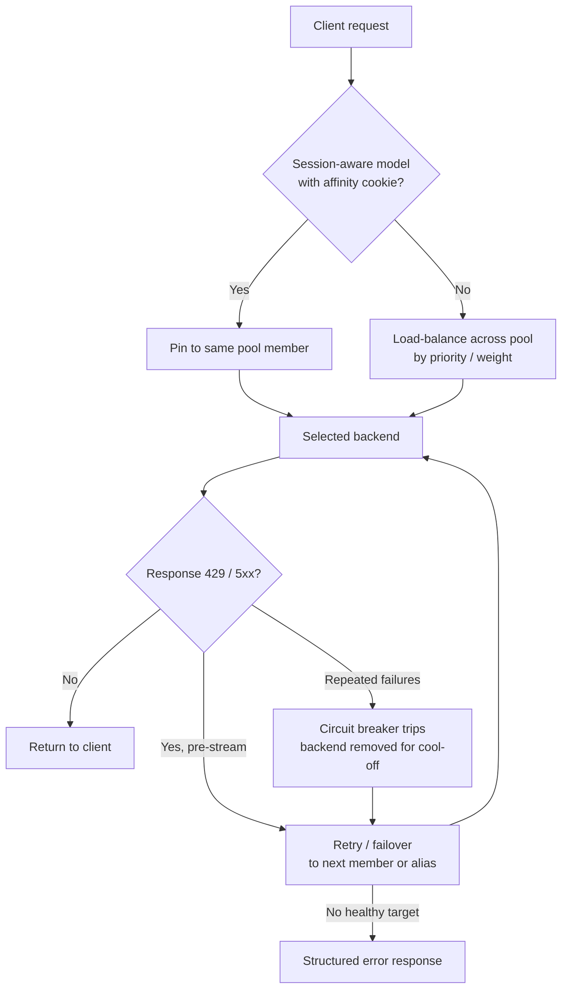

# Resiliency Guide

> **How the Citadel Governance Hub keeps LLM traffic flowing when backends throttle, fail, or hold state.** This guide covers the four resiliency dimensions the gateway handles — **circuit breaking**, **session affinity**, **automated failover**, and **error handling** — and, for each, answers *what* it is, *how* it works, and *when* to configure it.

The gateway is a single, governed front door in front of every LLM (Azure OpenAI, Microsoft Foundry, AWS Bedrock, Google Gemini, Anthropic Claude, and more). Because every call is proxied through Azure API Management (APIM), resiliency is enforced centrally in policy and backend configuration — clients get transparent protection without changing a line of app code.

---

## Resiliency at a Glance

The four dimensions work as **layers**. A single request can benefit from all of them at once: session affinity picks the *right* backend, load balancing spreads traffic across a pool, retry/failover moves off a failing member, and the circuit breaker takes a persistently unhealthy backend out of rotation (temporarily).



| Dimension | What it protects against | Default | Configure when |
|---|---|---|---|
| **[Circuit Breaker](#1-circuit-breaker)** | A persistently unhealthy backend dragging down latency and burning retries. | **On** (`configureCircuitBreaker: true`) | Almost always in production. Tune per-backend for noisy neighbours or strict SLAs. |
| **[Session Affinity](#2-session-affinity)** | Stateful conversations (Responses/Assistants API) breaking when a follow-up lands on the wrong pool member. | **Off per model** (`sessionAwareModel: false`) | A stateful model is served by a **pool** (2+ backends). |
| **[Automated Failover](#3-automated-failover)** | Transient throttling/5xx on one backend or provider causing a hard client failure. | **On** (retry + pools; alias fallback when configured) | Whenever a model runs on ≥2 backends, or you want cross-provider fallback via aliases. |
| **[Error Handling](#4-error-handling)** | Opaque failures that clients can't diagnose or safely retry. | **On** (structured JSON errors on every policy branch) | No config needed — use the [error catalog](#error-catalog) to interpret and react. |

> **Terminology.** "Resiliency" here spans both **availability** (staying up during transient faults via failover and circuit breaking) and **correctness under state** (session affinity). Error handling is the observability surface that ties them together.

---

## 1. Circuit Breaker

### What

A circuit breaker temporarily **stops routing to a backend once it starts failing**, then automatically probes it back into rotation after a cool-off. It prevents a sick backend from absorbing traffic, inflating latency, and wasting the retry budget — the classic *fail-fast* pattern applied per APIM backend.

The state machine is the standard three states:

- **Closed** — healthy, traffic flows normally.
- **Open (tripped)** — failure threshold breached; the backend is skipped for `tripDuration`. In a pool, traffic shifts to the remaining members.
- **Half-open** — after the cool-off, APIM lets a probe through; success closes the circuit, failure re-opens it.

### How

Every LLM backend created by `Backend Contract` onboarding gets a circuit breaker attached natively (not in policy). The rule is defined in [llm-backends.bicep](../bicep/infra/llm-backend-onboarding/modules/llm-backends.bicep) and controlled by three parameters in the [LLM Backend Onboarding](../bicep/infra/llm-backend-onboarding/README.md#circuit-breaker-configuration) `.bicepparam`:

1. **`configureCircuitBreaker`** (bool, default `true`) — master toggle. When `false`, no backend gets a breaker.
2. **`circuitBreakerDefaults`** (object) — the rule applied to **every** backend when the toggle is on.
3. **Per-backend `circuitBreaker`** (object, optional) — overrides a subset of the defaults for one backend, or disables it with `enabled: false`.

The default rule (backward-compatible with the original hard-coded values):

```bicep
param configureCircuitBreaker = true

param circuitBreakerDefaults = {
  failureCount: 3                 // trip after 3 failures...
  failureInterval: 'PT5M'         // ...within a rolling 5-minute window
  tripDuration: 'PT1M'            // stay open for 1 minute
  acceptRetryAfter: true          // honor an upstream Retry-After header
  errorReasons: [ 'Server errors' ]
  statusCodeRanges: [
    { min: 429, max: 429 }        // throttling
    { min: 500, max: 503 }        // server errors
  ]
}
```

| Property | Default | Meaning |
|---|---|---|
| `failureCount` | `3` | Failures within the window that trip the breaker. |
| `failureInterval` | `PT5M` | Rolling window used to count failures. |
| `tripDuration` | `PT1M` | How long the breaker stays open once tripped. |
| `acceptRetryAfter` | `true` | Honor an upstream `Retry-After` header when tripping. |
| `errorReasons` | `['Server errors']` | Failure reasons counted toward the breaker. |
| `statusCodeRanges` | `429`, `500-503` | HTTP status ranges (`{ min, max }`) treated as failures. |
| `enabled` | `true` | Per-backend only — set `false` to exempt one backend even when the master toggle is on. |

**Per-backend override** — trip a flaky backend faster, or exempt a special one:

```bicep
param llmBackendConfig = [
  {
    backendId: 'aif-citadel-primary'
    // ...
    circuitBreaker: { failureCount: 5, failureInterval: 'PT1M', tripDuration: 'PT30S' }
  }
  {
    backendId: 'aif-citadel-secondary'
    // ...
    circuitBreaker: { enabled: false }   // never trip this backend
  }
]
```

### When

| Situation | Recommendation |
|---|---|
| **Production, any topology** | Keep `configureCircuitBreaker: true`. This is the safe default. |
| **Model on a single backend** | The breaker still fires — but with no pool member to fail over to, requests fail fast during the cool-off. Pair single-backend critical models with an [alias fallback](#cross-provider-fallback-via-aliases). |
| **Backend behind strict latency SLA** | Lower `tripDuration` and `failureCount` so a degraded backend is shed quickly. |
| **Noisy backend that self-recovers fast** | Raise `failureCount` / shorten `failureInterval` to avoid tripping on brief blips. |
| **Backend under load test or intentionally saturated** | Set `enabled: false` for that backend so 429s don't remove it from rotation. |
| **`Retry-After`-aware provider (Azure OpenAI, Foundry)** | Keep `acceptRetryAfter: true` so the breaker honors the provider's back-pressure signal. |

> Because the breaker counts `429` as a failure, a heavily throttled backend is automatically parked, letting the pool's remaining members absorb traffic — this is the primary interplay between circuit breaking and [failover](#3-automated-failover).

---

## 2. Session Affinity

### What

Load balancing assumes every request is independent. **Stateful** models break that assumption: with the OpenAI **Responses API** and **Assistants API**, a follow-up call (e.g. referencing a `previous_response_id`) must reach the **same backend** that holds the conversation/thread state. Under round-robin pool routing it might not.

Session affinity (session-aware load balancing) makes a pool **sticky**: APIM sets a session cookie on the first response, and when the client replays it, routes the request back to the **same** pool member.

### How

Enablement is **per-model**, so one backend can freely mix stateful and stateless models. Configuration lives in the [LLM Backend Onboarding](../bicep/infra/llm-backend-onboarding/README.md#session-affinity-configuration) `.bicepparam`:

1. **`sessionAwareModel`** (bool on each model object, default `false`) — the opt-in. Only pools whose model is flagged become sticky.
2. **`configureSessionAffinity`** (bool, default `true`) — a global kill-switch. Safe to leave `true`, since nothing gets affinity until a model is flagged.
3. **`sessionAffinityDefaults`** (object) — cookie settings (`cookieName` default `ai-gateway-affinity`, `source` `Cookie`).
4. **Per-backend `sessionAffinity`** (object, optional) — overrides the cookie for the session-aware pools that backend joins.

```bicep
param llmBackendConfig = [
  {
    backendId: 'aif-citadel-primary'
    // ...
    supportedModels: [
      // Stateful — used with the OpenAI Responses API; its pool becomes sticky
      { name: 'gpt-4.1', modelFormat: 'OpenAI', modelVersion: '2025-04-14', sessionAwareModel: true }
      // Stateless — stays pure load-balanced
      { name: 'Phi-4', modelFormat: 'Microsoft', modelVersion: '3' }
    ]
    priority: 1
    weight: 100
  }
  {
    backendId: 'aif-citadel-secondary'
    // ...
    supportedModels: [
      { name: 'gpt-4.1', modelFormat: 'OpenAI', modelVersion: '2025-04-14', sessionAwareModel: true }
    ]
    priority: 2
    weight: 50
  }
]
```

**Resolution rules:**

- A pool becomes session-aware if **any** member flags that model `sessionAwareModel: true` (the flag is ORed across the pool).
- Cookie config = `sessionAffinityDefaults` shallow-merged with the **first** member supplying a `sessionAffinity` override.
- Single-backend (non-pooled) models are unaffected — affinity only matters when there are 2+ backends to choose between.

**Client requirement — the cookie jar.** Affinity only works if the client **persists and replays** the cookie. Use a **single HTTP client with a shared cookie jar (cookie container)** for all requests in one session, and separate jars for separate sessions:

```python
import httpx
from openai import OpenAI

# One cookie jar per logical session — APIM's Set-Cookie is echoed back on every follow-up call.
session_client = httpx.Client()  # persists Set-Cookie across requests
client = OpenAI(base_url="https://<apim-host>/unified-ai/openai", http_client=session_client)

first = client.responses.create(model="gpt-4.1", input="Hello")        # lands on backend A, sets cookie
follow = client.responses.create(model="gpt-4.1",
                                 previous_response_id=first.id,
                                 input="Continue")                      # cookie replays -> backend A
```

### When

| Situation | Recommendation |
|---|---|
| **Stateful model (Responses / Assistants API) on a pool** | **Required.** Flag the model `sessionAwareModel: true`. Without it, follow-up calls can hit the wrong backend and fail to find the conversation. |
| **Stateful model on a single backend** | Not needed — there's only one target. Affinity is a no-op. |
| **Stateless chat/completions/embeddings** | Leave `sessionAwareModel: false`. Pure load balancing gives better spread and resilience. |
| **Client can't hold a cookie jar** | Affinity can't work; keep the conversation on a single-backend model, or make each call self-contained. |
| **You must force affinity off everywhere** | Set `configureSessionAffinity: false` (global kill-switch). |

> **Affinity is best-effort, not a hard pin.** It's honored per gateway unit and yields to resilience: if a session's backend trips its [circuit breaker](#1-circuit-breaker), the request still fails over to another member (and may lose that backend's in-memory state). Design stateful flows to tolerate an occasional re-anchor.

**Validation:** [citadel-session-affinity-tests.ipynb](../validation/citadel-session-affinity-tests.ipynb).

---

## 3. Automated Failover

### What

Failover keeps a request alive when the first-choice target returns a **transient** error (throttling or server error). The gateway retries against a healthy alternative — another backend in the same pool, or (with model aliases) a different model or even a different cloud — transparently to the client.

Three mechanisms combine:

1. **Backend pools + load balancing** — the set of targets to fail over *to*.
2. **Retry logic** — the policy that triggers the failover on `429`/`5xx`.
3. **Cross-provider alias fallback** — extends the retry budget across models/providers.

### How

**Backend pools.** When multiple backends support the same model, the onboarding creates a load-balanced pool:

```
Model: "gpt-4o" -> Pool: "gpt-4o-backend-pool"
                    ├── Backend 1 (Priority: 1, Weight: 100)   ← preferred
                    └── Backend 2 (Priority: 2, Weight: 50)    ← failover target
```

- **Priority** — lower value = higher priority (`1` is highest). APIM sends traffic to the lowest-priority-number healthy members first.
- **Weight** — traffic ratio among members of the *same* priority.
- **Failover** — on `429`/`503` from a member, APIM automatically moves to the next member. A member removed by its [circuit breaker](#1-circuit-breaker) is skipped entirely.

Single-backend models route directly (no pool); their resilience comes from the circuit breaker + any alias fallback.

**Retry logic.** Every API policy retries transient failures before giving up:

```xml
<retry count="2" interval="0" first-fast-retry="true"
       condition="@(context.Response.StatusCode == 429 ||
                    context.Response.StatusCode >= 500)">
    <forward-request buffer-request-body="true" />
</retry>
```

The Unified AI API layers configurable timeouts from `metadata-config` on top:
- **Base timeout** 120s (or model-specific).
- **Streaming multiplier** 3× (via `timeout-settings.streaming-multiplier`).

**Cross-provider fallback via aliases.** A [model alias](./llm-access-guide.md#model-aliases) exposes one client-facing name (e.g. `adv-gpt`) that resolves at runtime to one of several real models, possibly across providers. The `<retry>` block is **alias-aware**: when `is-alias` is true, the retry budget is extended by the number of `alias-fallback-members`. On each transient failure it swaps in the next member (model + backend pool + auth) and re-runs resolution — enabling transparent **Foundry → Bedrock → Gemini** fallback.

```bicep
param modelAliases = [
  {
    name: 'adv-gpt'
    models: ['gpt-5', 'gpt-4.1', 'gpt-4o']   // priority order = failover order
    strategy: 'priority'                      // or 'weighted' for A/B / blended traffic
  }
]
```

> **Pre-stream only.** Once the response stream has started, the body is committed — cross-model/cross-backend fallback is no longer possible. This applies to both pool failover and alias fallback.

### When

| Situation | Recommendation |
|---|---|
| **High-availability for a model** | Deploy it on **2+ backends** (different instances/regions). The pool + retry gives automatic failover with no client change. |
| **Preferred primary + hot spare** | Give the primary `priority: 1` and the spare `priority: 2`. Traffic sticks to the primary until it fails. |
| **Blended / A-B traffic across backends** | Give members the **same priority** and split with `weight`. |
| **Provider-level outage tolerance** | Define a cross-provider **alias** (`strategy: 'priority'`) so a Foundry outage transparently fails over to Bedrock/Gemini. |
| **Controlled rollout of a new model** | Use an alias with `strategy: 'weighted'`. |
| **Streaming workloads** | Understand failover only helps **before** the first token. For critical streamed calls, keep the primary backend healthy (tuned circuit breaker) and consider client-side retry of the whole request. |
| **Single-backend model you can't scale out** | Add an alias fallback to a comparable model so throttling has somewhere to go. |

**Validation:** [citadel-model-aliases-tests.ipynb](../validation/citadel-model-aliases-tests.ipynb); background in the [LLM Access Guide — Retry Logic](./llm-access-guide.md#retry-logic).

---

## 4. Error Handling

### What

Every policy branch that rejects or fails a request returns a **structured JSON error** in the OpenAI error shape, so clients can diagnose and react programmatically:

```json
{
  "error": {
    "message": "Human-readable explanation",
    "type": "invalid_request_error | access_error | ...",
    "code": "machine_readable_code",
    "param": "model"
  }
}
```

The key resiliency question for any error is: **is it transient?** Transient errors (throttling, upstream 5xx, dependency unavailable) are safe to retry — often the gateway already retried for you. Non-transient errors (auth, RBAC, malformed request) will fail identically on retry and need a client- or config-side fix.

### Error catalog

| HTTP | `code` | Emitted by | Transient? | Meaning & how to address |
|---|---|---|---|---|
| **401** | `unauthorized` | [security-handler](../bicep/infra/modules/apim/policies/frag-security-handler.xml) | No | No valid subscription key. Send a valid key in the `api-key` header (also accepted as `Ocp-Apim-Subscription-Key`). |
| **401** | `jwt_required` | security-handler | No | Product requires a JWT but no Bearer token was sent. Add `Authorization: Bearer <token>`. See [JWT client identity](./jwt-client-identity-permissions.md). |
| **403** | *(model access forbidden)* | [validate-model-access](../bicep/infra/modules/apim/policies/frag-validate-model-access.xml) | No | Requested model isn't in the product's `allowedModels`. Grant it in the access contract or call a permitted model. |
| **403** | `backend_pool_access_forbidden` | [set-target-backend-pool](../bicep/infra/modules/apim/policies/frag-set-target-backend-pool.xml) | No | Client has no access to any backend pool serving the model (`allowedBackendPools`). Update the access contract. |
| **403** | `response_id_forbidden` | [responses-id-security](../bicep/infra/modules/apim/policies/frag-responses-id-security.xml) | No | The `response_id` was created by a **different subscription**. Only the owning subscription can read/continue it — expected isolation, not a bug. |
| **403** | `PathNotAllowed` | [request-processor](../bicep/infra/modules/apim/policies/frag-request-processor.xml) | No | The requested path isn't permitted for this API surface. Use a supported route (see [LLM Access Guide](./llm-access-guide.md)). |
| **400** | `missing_model_parameter` | set-target-backend-pool / [set-llm-requested-model](../bicep/infra/modules/apim/policies/frag-set-llm-requested-model.xml) | No | No `model` in the body/path. Include the model name. |
| **400** | `unsupported_model` | set-target-backend-pool | No | Model isn't hosted by any pool on this surface. Response lists `supported_models`. Onboard the model or pick a listed one. |
| **400** | `model_not_available_on_this_surface` | set-target-backend-pool | No | Model exists, but on a pool type this API surface can't route to (e.g. a native-only model called from the OpenAI-compat path). Use the correct surface — a native `/bedrock`, `/gemini`, or `/claude` path on the Unified AI API. |
| **400** | *(alias no compatible member)* | set-target-backend-pool (`ERROR_ALIAS_NO_COMPATIBLE_MEMBER`) | No | The alias has no member compatible with this surface's `compatible-pool-types`. Fix the alias definition or call a compatible surface. |
| **400** | *(image op unsupported)* | [path-builder](../bicep/infra/modules/apim/policies/frag-path-builder.xml) | No | Image operation not supported for the resolved backend type. Route the image request to a backend that supports it. |
| **500** | `AWSCredentialsNotConfigured` | [set-backend-authorization](../bicep/infra/modules/apim/policies/frag-set-backend-authorization.xml) | No (config) | Bedrock backend selected but `aws-access-key` / `aws-secret-key` / `aws-region` named values are missing. Set them (Key Vault-backed) and redeploy. |
| **502** | `PIIAnonymizationFailed` | [pii-anonymization](../bicep/infra/modules/apim/policies/frag-pii-anonymization.xml) | **Yes** | PII service is unavailable and `continueOnNLPError` is off, so the request was blocked (fail-closed) to prevent unmasked content reaching the backend. Retry; if acceptable, set `continueOnNLPError: true` to fail-open. See [PII Masking](./pii-masking-apim.md). |
| **429** | *(provider throttling)* | Upstream backend | **Yes** | Backend out of capacity or a capacity-control limit was hit. The gateway already retried/failed over across the pool; honor `Retry-After` and back off. Counts toward the [circuit breaker](#1-circuit-breaker) and is captured as a metric — see [Throttling Events Handling](./throttling-events-handling.md). |
| **500–503** | *(provider server error)* | Upstream backend | **Yes** | Transient backend failure. Retried automatically and counted toward the circuit breaker; if it persists past the retry budget, the breaker parks the backend and the pool sheds traffic to healthy members. |

### How to react

- **Transient (`429`, `500–503`, `502 PIIAnonymizationFailed`):** the gateway retries and fails over where possible. On the client, add bounded exponential backoff and honor `Retry-After`. Sustained transient errors indicate a **capacity or health** problem — add pool members, tune the circuit breaker, or define an [alias fallback](#cross-provider-fallback-via-aliases).
- **Non-transient (`400`, `401`, `403`, config `500`):** do **not** retry blindly — fix the request, credentials, or [access contract](./llm-access-guide.md#rbac-integration). The `message` and `code` tell you exactly what to change.
- **Observability.** Throttling is emitted as an App Insights custom metric per product/model/backend/app for alerting — see [Throttling Events Handling](./throttling-events-handling.md). PII degradation and `response_id` mismatches are traced. Use `UAIG-*` debug headers to see routing decisions per call.

### When to tune

| Signal | Action |
|---|---|
| Frequent `429` on one model | Add backend(s) to its pool (failover) and/or an alias fallback; review capacity allocation. |
| A backend repeatedly trips the breaker | Investigate the backend; consider lowering its priority or `enabled: false` until healthy. |
| Intermittent `502 PIIAnonymizationFailed` | Confirm PII service health; decide fail-closed (secure) vs `continueOnNLPError: true` (available). |
| Clients report lost conversation state | Verify the stateful model is `sessionAwareModel: true` **and** the client uses a shared cookie jar. |
| Clients retry non-transient `4xx` | Educate clients to branch on `error.code`; only `429`/`5xx` are safe to retry. |

---

## Putting It Together

A resilient production onboarding for a critical model typically combines all four dimensions:

```bicep
param configureCircuitBreaker = true        // fail-fast on unhealthy backends
param configureSessionAffinity = true       // enable stickiness where flagged

param llmBackendConfig = [
  {
    backendId: 'aif-primary'
    endpoint: 'https://aif-primary.cognitiveservices.azure.com/'
    authType: 'managed-identity'
    supportedModels: [
      { name: 'gpt-4.1', modelFormat: 'OpenAI', modelVersion: '2025-04-14', sessionAwareModel: true }
    ]
    priority: 1                              // preferred
    weight: 100
  }
  {
    backendId: 'aif-secondary'
    endpoint: 'https://aif-secondary.cognitiveservices.azure.com/'
    authType: 'managed-identity'
    supportedModels: [
      { name: 'gpt-4.1', modelFormat: 'OpenAI', modelVersion: '2025-04-14', sessionAwareModel: true }
    ]
    priority: 2                              // failover target -> forms a pool with aif-primary
    weight: 50
  }
]

param modelAliases = [
  { name: 'adv-gpt', models: ['gpt-4.1', 'gpt-4o'], strategy: 'priority' }  // cross-model fallback
]
```

This yields: a **load-balanced pool** for `gpt-4.1` (priority failover), **session affinity** for its stateful Responses-API traffic, a **circuit breaker** on each backend, and an **alias** giving cross-model fallback — all transparent to clients, with **structured errors** whenever a request can't be served.

---

## Related Guides

- [LLM Access Guide](./llm-access-guide.md) — routing internals, backend pools, retry logic, model aliases.
- [Throttling Events Handling](./throttling-events-handling.md) — monitoring `429`s and alerting in Azure Monitor.
- [PII Masking with APIM](./pii-masking-apim.md) — PII anonymization fail-closed vs fail-open behavior.
- [JWT Client Identity & Permissions](./jwt-client-identity-permissions.md) — auth errors and access contracts.
- [LLM Backend Onboarding](../bicep/infra/llm-backend-onboarding/README.md) — full circuit-breaker and session-affinity parameter reference.
